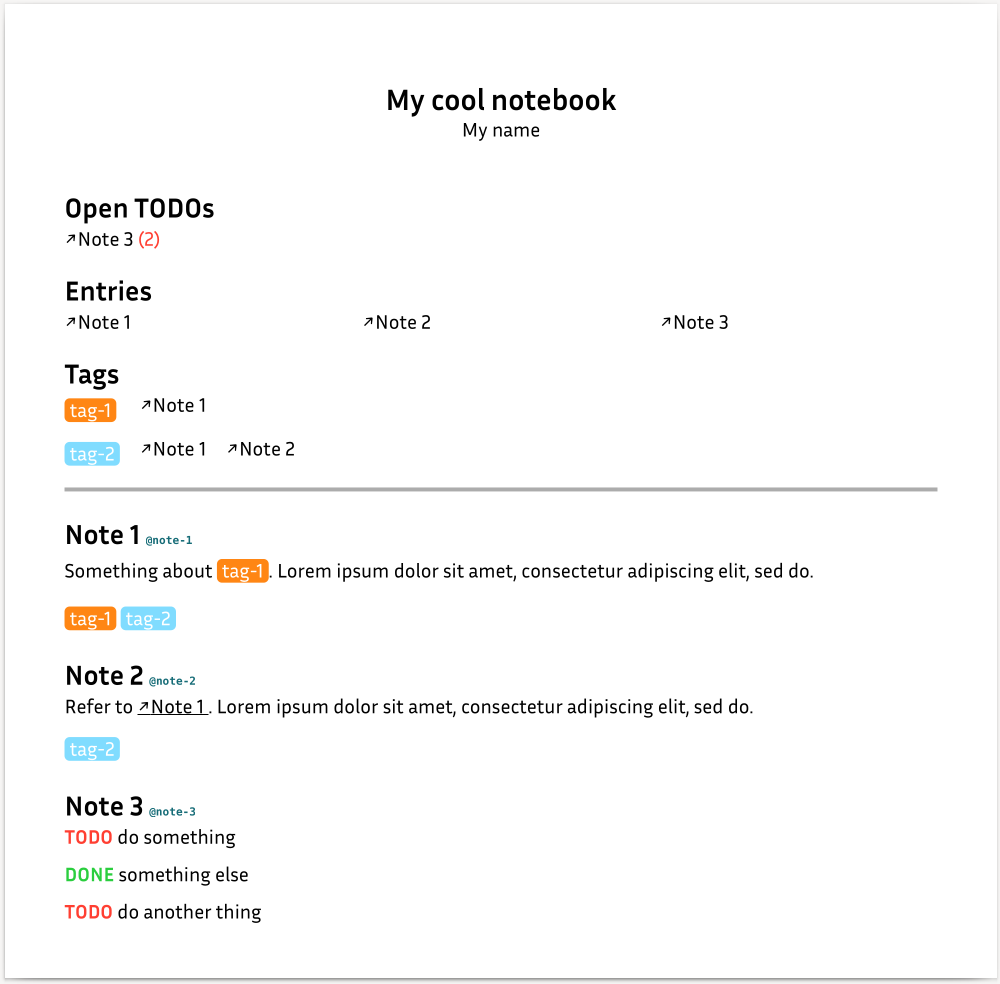

# Typst notebook


This is a small template to write a notebook using [Typst](https://typst.app).

## Getting started
Put the file `template-notebook.typ` in the directory where you want to store
your notebook.

Then, create a `notebook.typ` file similar to the following:
```typ
#import "template-notebook.typ": notebook

// not necessary, but I think the font works good for a notebook
#set text(font: "Inria Sans")

#show: notebook.with(
  title: [My cool notebook],
  author: [My name],
  tags: (
    tag-1: orange,
    tag-2: aqua,
  )
)

= Note 1

Something about @tag-1.
#lorem(10)

@tag-1 @tag-2


= Note 2

Refer to @note-1.
#lorem(10)

@tag-2


= Note 3

TODO do something

DONE something else

TODO do another thing
```

This produces the following document:



## Features

### The document itself
Using this template creates a document with a single ever-growing page.
This is achieved by using `#set page(height: auto)`.
The width of that page can be configured using the `width` argument in the
template function:
```typ
#show: notebook.with(
  // ...
  width: 80em,
)
```

### Creating notes
By using a level-one heading (`= Heading`), you create a new note.
It is automatically assigned a label based on its title text that is printed next
to the title for convenience, so that you know what to refer to.

### Keeping track of TODOs
Whenever you put `TODO` somewhere in your notes, it is recognised, printed in
red, and the containing note is added to a list of TODOs at the top of the
document.
When there are more than one TODOs in one note, a counter next to the title
informs you about that fact.
The title in the TODO list is a link to that note.

### Referring to other notes
As explained above, each note automatically gets its label.
The name of the label can be found next to the title in the document.
By using Typst's reference syntax, you can link to that note (e.g. `@note-1` for
a note that was created with `= Note 1`).

### Using tags
At the top of your code, when you apply the template function, you can give a list
of tags in the form of a Typst dictionary.
The keys are the names of the tags and the values are the colors they are supposed
to have.
The name of the tag is printed in white per default.
If, however, you want to have a tag with a very light color, that can become an
issue.
In that case, you can use a more complex syntax:
```typ
tags: (
  tag-1: red,
  tag-2: (color: silver, text-color: black),
)
```
For `tag-1: red`, we could therefore also write
`tag-1: (color: red, text-color: white)`.

You can refer to a tag in your notes again using the refernce syntax.
For example, `@tag-1` creates a link to an overview of `tag-1` at the top of the
document.
In this overview, you can find all notes that mention this tag and by clicking
any of their titles in this list you can jump to that note.

### Entry overview
Also at the top of the document, you can find an automatic table of contents
with all then entries in your notebook.

## Considerations for choosing the PDF viewer
Some PDF viewers like `evince` on Linux have a _preview_ feature that comes in
really handy here.
For example, if you look at the TODO overview in the example doument above and
want to know what kind of TODOs you have for Note 3 without jumping there, you
can just hover the mouse pointer over the title:

https://github.com/andreasKroepelin/typst-notebook/assets/42342396/0a808f54-3719-4ca6-a7a3-17585d1ee2ae


## Shell support
In `scripts/note.fish`, you can find a utility function for the fish shell to
create new notes more easily.
If you copy this file to `~/.config/fish/functions/`, you can call it as
`note "Some title"` in fish and it creates a new file `some-title.typ` with content
```typ
= Some title
```
and adds
```typ
#include "some-title.typ"
```
to `notebook.typ`.

If you omit the title argument (i.e. you just call `note`), it uses the current
date in the form `2023-jun-01` as the title.

Contributions porting this script to other shells are welcome.

